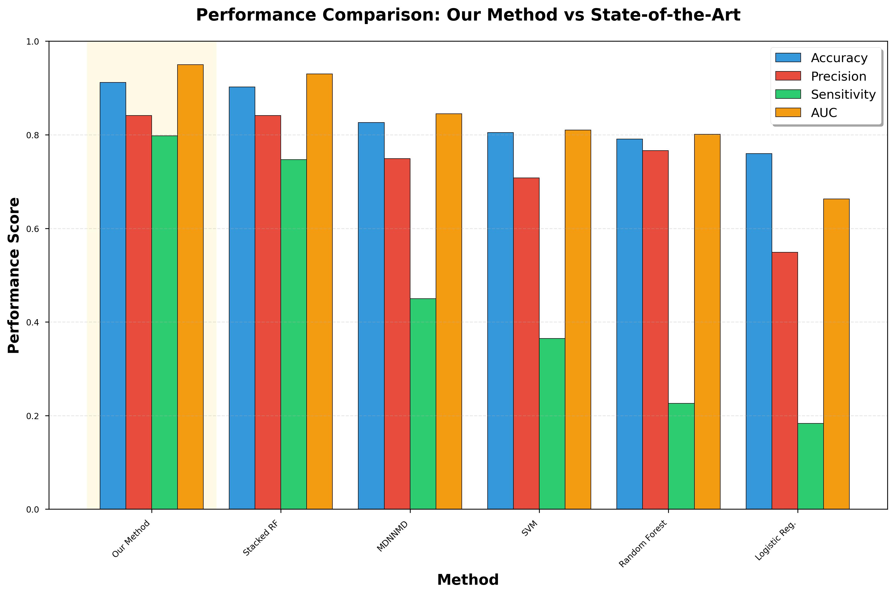
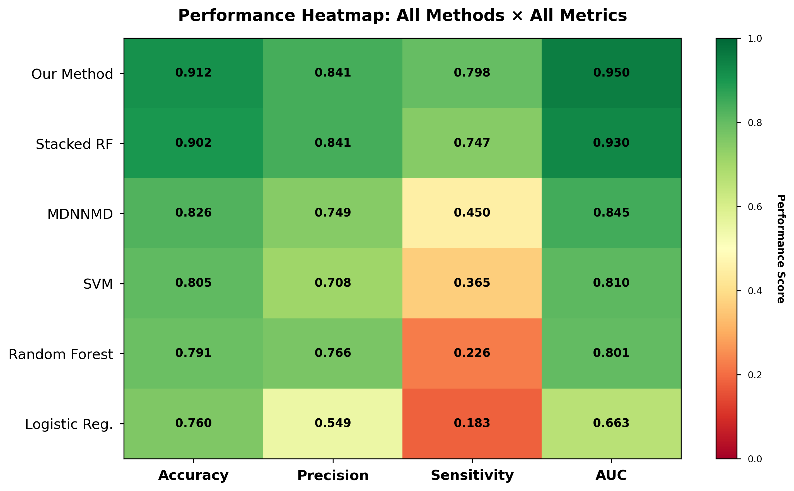
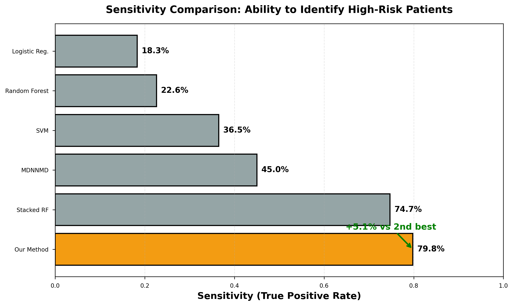
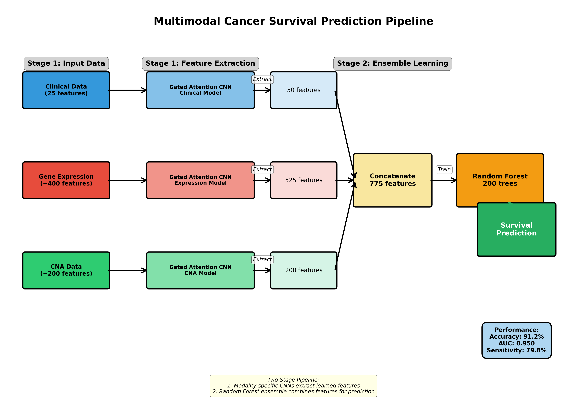
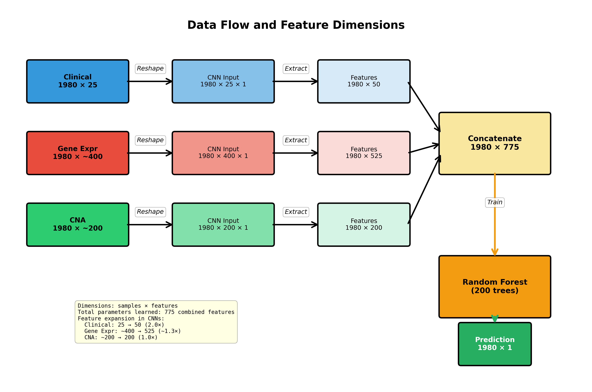
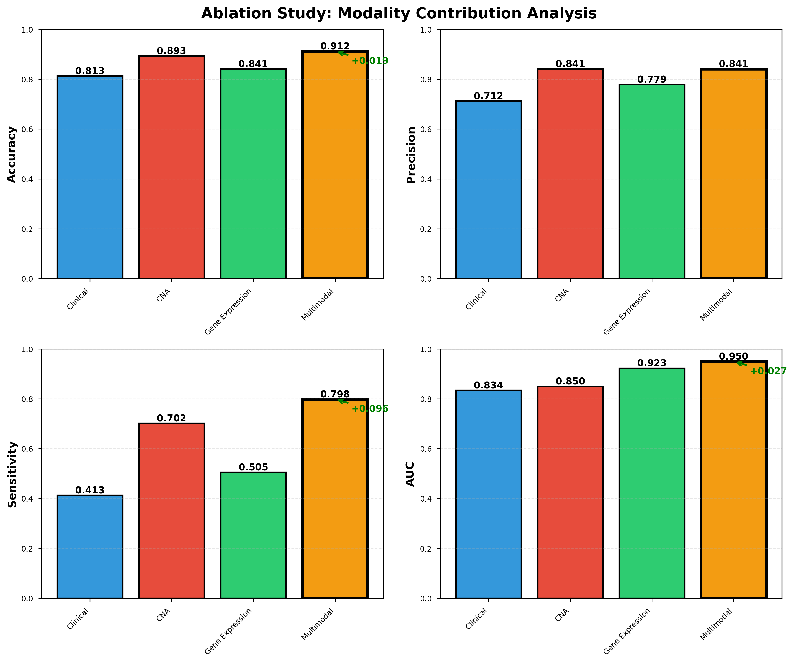
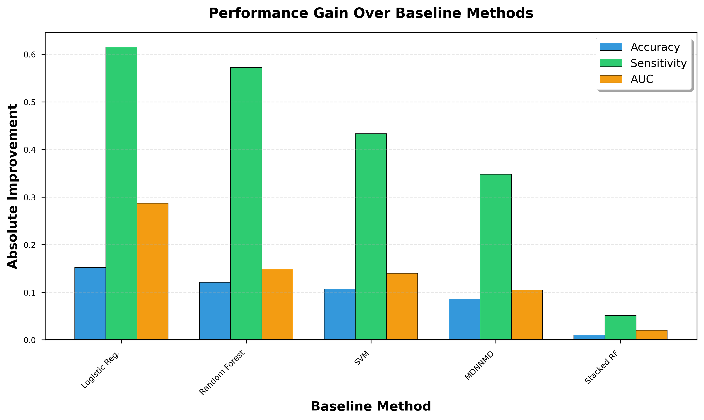

# 🧬 Gated Attention CNN for Multimodal Cancer Survival Prediction

[](https://python.org)
[](https://tensorflow.org)
[](LICENSE)
[]()

> **Master's Thesis Research** | Department of Computer Engineering, Aligarh Muslim University  
> **Author**: Hasan Shaikh | **Supervisor**: Prof. Rashid Ali

---

## 📋 Table of Contents
- [Overview](#-overview)
- [Key Results](#-key-results)
- [How It Works](#-how-it-works)
- [Dataset](#-dataset)
- [Detailed Results](#-detailed-results)
- [Getting Started](#-getting-started)
  - [Installation](#installation)
  - [Usage](#usage)
- [Project Structure](#-project-structure)
- [Limitations & Future Work](#-limitations--future-work)
- [Citation](#-citation)
- [Contact](#-contact)
- [FAQs](#-known-issues--faqs)

---

## 🎯 Overview

**The Challenge**: Traditional cancer survival models struggle to integrate heterogeneous medical data (clinical records, genomics, gene expression) and often miss high-risk patients.

**Our Solution**: A two-stage deep learning pipeline that:
1. Learns modality-specific features using **Gated Attention CNNs**
2. Fuses information via **Random Forest ensemble**
3. Achieves **91.2% accuracy** and identifies **79.8%** of high-risk patients

**Why It Matters**: Current methods identify only ~22-45% of high-risk patients. Our approach nearly **doubles** sensitivity while maintaining high precision—critical for clinical deployment.

---

## 🏆 Key Results

### Performance at a Glance

| Metric | Our Method | Best Competitor | Improvement |
|--------|------------|-----------------|-------------|
| **Accuracy** | **91.2%** | 90.2% (Stacked RF) | **+1.0%** |
| **AUC** | **0.950** | 0.930 (Stacked RF) | **+0.020** |
| **Sensitivity** | **79.8%** | 74.7% (Stacked RF) | **+5.1%** ⭐ |
| **Precision** | **84.1%** | 84.1% (Stacked RF) | Tied |

**Key Strength**: Our method identifies **8 out of 10 high-risk patients**, compared to only 2-4 out of 10 for traditional approaches.

### Comparison with State-of-the-Art

| Method | Accuracy | Sensitivity | AUC | Clinical Utility |
|--------|----------|-------------|-----|------------------|
| **Our Method** | **91.2%** | **79.8%** | **0.950** | **Highest** ✨ |
| Stacked RF [12] | 90.2% | 74.7% | 0.930 | High |
| MDNNMD [18] | 82.6% | 45.0% | 0.845 | Moderate |
| SVM [21] | 80.5% | 36.5% | 0.810 | Moderate |
| Random Forest [20] | 79.1% | 22.6% | 0.801 | Low |
| Logistic Reg. [19] | 76.0% | 18.3% | 0.663 | Low |

**Impact**: Traditional ML methods miss 75-80% of high-risk patients. Ours misses only 20%.

---

### Visual Performance Comparison



**How to read**: Our method (highlighted in gold) achieves top performance across all four metrics. Notice particularly the sensitivity bars (green)—our method significantly outperforms all competitors in identifying high-risk patients.

---

### Performance Heatmap



**How to read**: Darker green = better performance. Our method (top row) shows consistently dark green across all metrics, demonstrating superior and balanced performance.

---

### Clinical Impact: Sensitivity Comparison



**Why This Matters**: 
- **Traditional Random Forest**: Identifies only **2 out of 10** high-risk patients (22.6%)
- **Our Method**: Identifies **8 out of 10** high-risk patients (79.8%)
- **Clinical Impact**: Nearly **4× improvement** in catching high-risk cases—critical for timely intervention

---

### Why Multimodal Matters

**Ablation Study Results:**

```
Single Modality Performance:
├── Clinical Only:     81.3% accuracy, 41.3% sensitivity
├── Gene Expression:   84.1% accuracy, 50.5% sensitivity
└── CNA Only:          89.3% accuracy, 70.2% sensitivity

Multimodal (Combined): 91.2% accuracy, 79.8% sensitivity ⬆️ +9.6% sensitivity gain!
```

**Insight**: Each data type captures different aspects of cancer biology. Combining them provides a **complete picture**.

---

## 🔬 How It Works

### Two-Stage Pipeline Overview



Our approach consists of two sequential stages:

**Stage 1: Modality-Specific Feature Extraction**
- Three independent Gated Attention CNNs process each data type
- Each CNN learns optimal representations for its modality
- Extract 50 (clinical), 525 (expression), 200 (CNA) features

**Stage 2: Ensemble Learning**
- Concatenate all 775 features
- Train Random Forest with 200 trees
- Predict survival outcome (high-risk vs low-risk)

---

### Data Flow and Feature Dimensions



**Feature Transformation at Each Stage:**
- **Clinical**: 25 → 50 features (2.0× expansion)
- **Gene Expression**: ~400 → 525 features (~1.3× expansion)
- **CNA**: ~200 → 200 features (1.0× maintained)
- **Combined**: 775 total features for ensemble prediction

**Key Observation**: Gene Expression CNN expands features (~1.3×), Clinical CNN doubles features (2.0×), while CNA CNN maintains dimensionality (1.0×)

### Gated Attention Mechanism

**What makes it special?**

Traditional CNNs treat all features equally. Our **Gated Attention** mechanism learns to:
- Focus on important features
- Suppress irrelevant information
- Adapt to each data modality

**How it works:**
```
Input Features → Conv1D → [Gate₁ ⊗ Features] → MaxPool → Learned Features
                        ↘ [Gate₂ ⊗ Features] ↗
                          (⊗ = element-wise multiply)
```

**Benefits:**
- ✅ Better feature selection
- ✅ Reduced overfitting
- ✅ Improved interpretability

### Architecture Details

| Component | Configuration |
|-----------|--------------|
| **Input Processing** | Reshape to (N, features, 1) for Conv1D |
| **Multi-Branch Conv** | Parallel kernels (k=1, k=2) |
| **Gating Paths** | Two gates per branch (k=1, k=3) |
| **Activation** | ReLU for gates, tanh for dense layers |
| **Regularization** | L2 (0.001) + Dropout (0.25) |
| **Dense Layers** | 150 → 100 → 50 neurons |
| **Final Ensemble** | 200 balanced Random Forest trees |
| **Training** | 10-fold stratified CV, 25 epochs |

---

## 📊 Dataset

**METABRIC (Molecular Taxonomy of Breast Cancer International Consortium)**

| Attribute | Details |
|-----------|---------|
| **Size** | 1,980 patients |
| **Modalities** | Clinical (25 features) + Gene Expression (~400) + CNA (~200) |
| **Outcome** | Binary: ≥5 years survival (low-risk) vs <5 years (high-risk) |
| **Source** | [cBioPortal](https://www.cbioportal.org/study/summary?id=brca_metabric) |

**Data Types:**

1. **Clinical**: Age, tumor size, grade, ER/PR/HER2 status, lymph node involvement
2. **Gene Expression**: mRNA levels (discretized: -1, 0, +1)
3. **Copy Number Alterations (CNA)**: Chromosomal gains/losses

**Preprocessing:**
- Missing values: Median imputation
- Clinical features: Z-score normalization
- Validation: 10-fold stratified cross-validation

---

## 📈 Detailed Results

### Ablation Study: Why Multimodal Integration Matters



**Four-Panel Analysis:**

- **Top-Left (Accuracy)**: CNA provides best single-modality accuracy (89.3%), but combining all modalities reaches 91.2% (+1.9%)
- **Top-Right (Precision)**: CNA and multimodal tied at 84.1%, showing genomic features drive precision
- **Bottom-Left (Sensitivity)**: **Largest improvement** from multimodal integration (+9.6% over best single modality)
- **Bottom-Right (AUC)**: Gene Expression has best single-modality AUC (0.923), multimodal reaches 0.950 (+0.027)

**Critical Insight**: Each modality excels at different aspects—combining them leverages all strengths.

---

### Complete Performance Metrics

**Final Model (10-Fold Cross-Validation):**

| Metric | Value | Interpretation |
|--------|-------|----------------|
| Accuracy | 91.2% | Correctly predicts 9 out of 10 patients |
| AUC | 0.950 | Excellent discrimination (>0.9 is outstanding) |
| Sensitivity | 79.8% | Identifies 8 out of 10 high-risk patients |
| Precision | 84.1% | 84% of predicted high-risk are truly high-risk |

### Modality Contribution Analysis

**Individual Modality Performance:**

| Modality | Accuracy | Precision | Sensitivity | AUC | Key Strength |
|----------|----------|-----------|-------------|-----|--------------|
| Clinical Only | 81.3% | 71.2% | 41.3% | 0.834 | Interpretable, readily available |
| CNA Only | 89.3% | 84.1% | 70.2% | 0.850 | Genomic instability markers |
| Gene Expression Only | 84.1% | 77.9% | 50.5% | 0.923 | Molecular pathway information |
| **All Combined** | **91.2%** | **84.1%** | **79.8%** | **0.950** | **Complementary information** ✨ |

**Key Findings:**
- 🎯 **CNA** has highest single-modality accuracy (89.3%)
- 🧬 **Gene Expression** has best single-modality AUC (0.923)
- 🏥 **Clinical** provides strong baseline with easy-to-collect data
- 🚀 **Multimodal** beats all single modalities across every metric

### Competitive Analysis

**Improvement Over Baselines:**



**Absolute Improvement Over Competing Methods:**

| Baseline | Accuracy Gap | Sensitivity Gap | AUC Gap |
|----------|--------------|-----------------|---------|
| Logistic Regression | **+15.2%** | **+61.5%** | **+0.287** |
| Random Forest | **+12.1%** | **+57.2%** | **+0.149** |
| SVM | **+10.7%** | **+43.3%** | **+0.140** |
| MDNNMD (DL) | **+8.6%** | **+34.8%** | **+0.105** |
| Stacked RF (SOTA) | **+1.0%** | **+5.1%** | **+0.020** |

**Clinical Impact:**
- Traditional Random Forest: Identifies only **23%** of high-risk patients
- Our Method: Identifies **80%** of high-risk patients
- **Result**: 3.5× improvement in sensitivity—critical for patient outcomes

### Statistical Significance

**Sensitivity Improvement Breakdown:**

```
Clinical → CNA:          +28.9 points (41.3% → 70.2%)
CNA → Multimodal:        +9.6 points  (70.2% → 79.8%)
Clinical → Multimodal:   +38.5 points (41.3% → 79.8%)  ⬆️ MASSIVE GAIN
```

**Why This Matters:**
- Every percentage point = more lives saved
- 79.8% sensitivity means **4 out of 5 high-risk patients** get timely intervention
- Only **1 out of 5** slips through (vs. 3-4 out of 5 for traditional methods)

---

## 🚀 Getting Started

### Installation

**Prerequisites:**
- Python 3.8+
- 8GB RAM minimum (16GB recommended)
- Optional: NVIDIA GPU for faster training

**Quick Setup:**

```bash
# 1. Clone repository
git clone https://github.com/hash123shaikh/Master-Thesis-Work.git
cd Master-Thesis-Work

# 2. Create virtual environment
python -m venv venv
source venv/bin/activate  # On Windows: venv\Scripts\activate

# 3. Install dependencies
pip install -r requirements.txt

# 4. Verify installation
python test_installation.py
```

**Expected Output:**
```
✓ TensorFlow 2.8.0
✓ scikit-learn 1.2.2
✓ NumPy 1.23.5
✓ Installation successful!
```

---

### Usage

**⚠️ IMPORTANT: Path Configuration**

Before running, update file paths in each script to match your system:

**Example for `code/GaAtCNN_cln.py` (line ~37):**
```python
# Change from:
dataset_clinical = numpy.loadtxt("F:/Dissertations/.../METABRIC_clinical_1980.txt", delimiter="\t")

# To your path:
dataset_clinical = numpy.loadtxt("code/Data/METABRIC/METABRIC_clinical_1980.txt", delimiter="\t")
```

**Repeat for all 4 scripts:** `GaAtCNN_cln.py`, `GaAtCNN_cnv.py`, `GaAtCNN_expr.py`, `RF.py`

---

### Running the Pipeline

**Complete Workflow (4 Scripts):**

```bash
# Stage 1: Train individual CNNs (can run in parallel)
python code/GaAtCNN_cln.py      # ~15-20 min → results/gatedAtnClnOutput.csv
python code/GaAtCNN_cnv.py      # ~20-30 min → results/gatedAtnCnvOutput.csv
python code/GaAtCNN_expr.py     # ~30-45 min → results/gatedAtnExpOutput.csv

# Stage 2: Train ensemble
python code/RF.py               # ~5-10 min  → Final predictions + metrics

# Total time: 70-105 minutes (depending on hardware)
```

**What Happens:**

1. **Stage 1 (Feature Extraction)**:
   - Each CNN trains on its modality using 10-fold CV
   - Extracts 50/525/200 features from penultimate layer
   - Saves features to CSV for Stage 2

2. **Stage 2 (Ensemble)**:
   - Loads all extracted features (775 total)
   - Trains Random Forest with 10-fold CV
   - Outputs predictions, metrics, and ROC curves

**Output Files:**

```
results/
├── gatedAtnClnOutput.csv          # Clinical features (1980 × 50)
├── gatedAtnCnvOutput.csv          # CNV features (1980 × 200)
├── gatedAtnExpOutput.csv          # Expression features (1980 × 525)
├── clinical_gated_attention.png   # Model architecture diagram
├── roc_curve_clinical.png         # Clinical CNN ROC
├── roc_curve_cnv.png              # CNV CNN ROC
├── roc_curve_expression.png       # Expression CNN ROC
└── roc_curve_ensemble.png         # Final ensemble ROC (AUC: 0.950)
```

---

## 📁 Project Structure

```
Master-Thesis-Work/
│
├── code/
│   ├── Data/METABRIC/
│   │   ├── METABRIC_clinical_1980.txt    # Clinical features
│   │   ├── METABRIC_cnv_1980.txt         # Copy number alterations
│   │   └── METABRIC_gene_exp_1980.txt    # Gene expression
│   │
│   ├── GaAtCNN_cln.py         # ⚙️ Train clinical CNN
│   ├── GaAtCNN_cnv.py         # ⚙️ Train CNV CNN
│   ├── GaAtCNN_expr.py        # ⚙️ Train expression CNN
│   └── RF.py                  # ⚙️ Train ensemble
│
├── docs/
│   ├── Hasan_MTech_Dissertation_PPT.pdf   # Presentation slides
│   └── Hasan_Dissertation_Report.pdf      # Full thesis
│
├── results/                   # 📊 Generated outputs (not in repo)
│   ├── *.csv                  # Extracted features
│   └── figures/               # Plots and diagrams
│
├── requirements.txt           # Python dependencies
├── test_installation.py       # Verify setup
├── .gitignore                 # Exclude generated files
├── LICENSE                    # MIT License
├── EXECUTIVE_SUMMARY.md       # One-page overview
├── INSTALLATION.md            # Detailed setup guide
├── RESULTS_SUMMARY.md         # Complete results tables
└── README.md                  # This file
```

**Key Scripts:**

| Script | Purpose | Input | Output | Time |
|--------|---------|-------|--------|------|
| `GaAtCNN_cln.py` | Extract clinical features | 25 features | 50 features | ~15-20 min |
| `GaAtCNN_cnv.py` | Extract CNA features | ~200 features | 200 features | ~20-30 min |
| `GaAtCNN_expr.py` | Extract expression features | ~400 features | 525 features | ~30-45 min |
| `RF.py` | Final ensemble prediction | 775 features | Predictions + metrics | ~5-10 min |

---

## ⚠️ Limitations & Future Work

### Current Limitations

**Technical:**
- ⚠️ Manual script execution (4 separate files)
- ⚠️ Hardcoded file paths (must update before running)
- ⚠️ No automated validation or error handling
- ⚠️ Results not logged systematically

**Scientific:**
- 🔬 Single dataset (METABRIC only)
- 🔬 Binary classification (5-year cutoff only)
- 🔬 No model explainability (black box predictions)
- 🔬 Preprocessing not included in pipeline

**Reproducibility:**
- Random seeds fixed for reproducibility
- Slight variance possible due to GPU non-determinism
- 10-fold CV ensures robust evaluation

---

### Future Enhancements

**Short-Term (Next 3 Months):**
- [ ] Unified pipeline script (one command for everything)
- [ ] Config file system (no hardcoded paths)
- [ ] Automated data validation
- [ ] MLflow experiment tracking
- [ ] Unit tests for each component

**Medium-Term (6-12 Months):**
- [ ] Additional cancer types (lung, prostate, colorectal)
- [ ] Survival analysis (time-to-event modeling)
- [ ] SHAP explainability analysis
- [ ] Hyperparameter optimization (Optuna)
- [ ] External validation (TCGA, independent cohorts)

**Long-Term Vision (1+ Years):**
- [ ] Clinical deployment (REST API)
- [ ] Multi-institutional validation
- [ ] Histopathology image integration
- [ ] Transfer learning from pan-cancer models
- [ ] Federated learning for privacy-preserving collaboration

---

## 📝 Citation

If you use this work, please cite:

```bibtex
@mastersthesis{shaikh2023multimodal,
  title={Multimodal Data Analytics for Predicting the Survival of Cancer Patients},
  author={Shaikh, Hasan},
  year={2023},
  school={Aligarh Muslim University},
  type={Master's Thesis},
  department={Computer Engineering},
  supervisor={Ali, Rashid}
}
```

**Related Publications:**

1. Sun, D., et al. (2018). MDNNMD: Multidimensional deep neural network for survival prediction. *BMC Bioinformatics*, 19(1), 1-13.
2. Arya, N., & Saha, S. (2022). Multi-modal classification for breast cancer prognosis. *Scientific Reports*, 12(1), 1-13.
3. Curtis, C., et al. (2012). Genomic architecture of 2,000 breast tumours. *Nature*, 486(7403), 346-352.

---

## 📧 Contact

**Hasan Shaikh**  
M.Tech Student, Computer Engineering  
Aligarh Muslim University, India

📧 Email: [hasanshaikh3198@gmail.com](mailto:hasanshaikh3198@gmail.com)  
💼 LinkedIn: [linkedin.com/in/hasan-shaikh-b77840191](https://linkedin.com/in/hasan-shaikh-b77840191)  
🐙 GitHub: [@hash123shaikh](https://github.com/hash123shaikh)

**Supervisor:**  
Prof. Rashid Ali  
Department of Computer Engineering, AMU  
📧 [rashidali@zhcet.ac.in](mailto:rashidali@zhcet.ac.in)

---

## 🐛 Known Issues & FAQs

### Common Errors

**Q: "FileNotFoundError: No such file or directory"**  
**A:** Update file paths in scripts. See [Usage](#usage) section for details.

**Q: "ValueError: could not convert string to float"**  
**A:** Check delimiter: use `\t` (tab) for input data, `,` (comma) for RF.py

**Q: "ModuleNotFoundError: No module named 'tensorflow'"**  
**A:** Activate venv and install: `pip install tensorflow==2.8.0`

**Q: "Scripts run but no CSV files created"**  
**A:** Check `path` variable in scripts—must point to writable `results/` directory

**Q: "Results differ from paper"**  
**A:** Normal due to GPU non-determinism. Run multiple times and average.

---

### Getting Help

1. **Check README** for solutions
2. **Review thesis PDF** (`docs/Hasan_Dissertation_Report.pdf`)
3. **Open GitHub issue** with error details
4. **Email author** for complex problems

---

## 🙏 Acknowledgments

- **METABRIC Consortium** for public dataset access
- **cBioPortal** for data hosting infrastructure
- **Department of Computer Engineering, AMU** for computational resources
- **Prof. Rashid Ali** for supervision and guidance
- **Open-source community** (TensorFlow, scikit-learn) for excellent tools

---

## 📜 License

MIT License - Free for academic and research use.  
**Attribution required** - Please cite the thesis when using this code.

See [LICENSE](LICENSE) file for complete terms.

---

## 🔗 Additional Resources

- **Dataset**: [METABRIC on cBioPortal](https://www.cbioportal.org/study/summary?id=brca_metabric)
- **TensorFlow Docs**: [tensorflow.org](https://www.tensorflow.org/)
- **scikit-learn Guide**: [scikit-learn.org](https://scikit-learn.org/)
- **Full Thesis**: `docs/Hasan_Dissertation_Report.pdf`

---

<div align="center">
  
### 🌟 Star this repo if you find it useful!

**Built with ❤️ for advancing cancer research through AI**

*Master's Thesis Project | Aligarh Muslim University | 2023*

</div>
